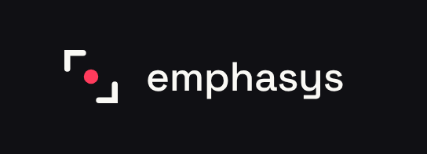

<p align="center">
    
</p>

<h1 align="center">emphasys</h1>

<p align="center">
    A modern React UI framework for rapidly building responsive, grid-based interfaces.
</p>

<p align="center">
    <a href="#about">About</a> •
    <a href="#features">Features</a> •
    <a href="#getting-started">Getting Started</a> •
    <a href="#roadmap">Roadmap</a>
</p>

---

## About

**Emphasys** is a React-based UI framework focused on making structured, responsive layouts faster to build.

Instead of repeatedly writing the same grid, card, spacing, and responsive layout boilerplate, Emphasys provides reusable components and UI scaffolding that developers can build upon.

The goal is simple:

> **Build the structure. Emphasize the content.**

emphasys is currently in early development.

---

## Features

### 🧱 Grid-Based Layouts

Create responsive layouts using a simple component structure.

```tsx
<Grid columns={12} gap="md">
    <GridItem span={4}>
        <Card />
    </GridItem>

    <GridItem span={8}>
        <Card />
    </GridItem>
</Grid>
```

### 🃏 Reusable Components

Build interfaces from composable components such as:

* `Grid`
* `GridItem`
* `Card`
* `Card.Header`
* `Card.Title`
* `Card.Content`

More components will be introduced as the framework develops.

### ⚡ UI Scaffolding

emphasys aims to generate the repetitive structural code needed to begin building an interface, allowing developers to focus on their application's actual content and functionality.

---

## Getting Started

> **Note:** emphasys is currently under active development and is not yet ready for production use.

Installation and usage instructions will be added as the framework's API stabilizes.

---

## Roadmap

* [ ] Establish core component architecture
* [ ] Implement `Grid`
* [ ] Implement `GridItem`
* [ ] Implement `Card`
* [ ] Add responsive grid behavior
* [ ] Establish Emphasys design system
* [ ] Build component generator CLI
* [ ] Add TypeScript support
* [ ] Add documentation
* [ ] Add automated tests
* [ ] Publish initial npm package

---

## Philosophy

emphasys is designed around a simple idea:

**Developers shouldn't have to repeatedly build the same interface structure from scratch.**

emphasys handles the structure so developers can emphasize what actually matters — their application.

---

## Status

🚧 **Early Development**

emphasys is currently an experimental project and its API is subject to change.

---

## License

License information will be added as the project develops.
